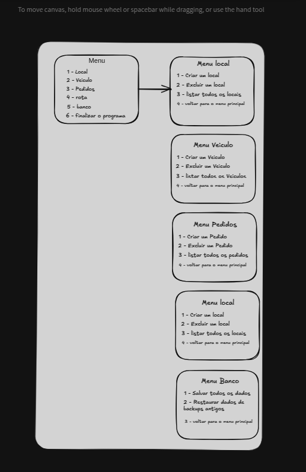

# Sistema de Logística de Entrega de Mercadorias (SLEM)

## Descrição

O objetivo deste trabalho é desenvolver um Sistema de Logística de Entrega de Mercadorias
utilizando os conceitos de algoritmos e estruturas de dados aprendidos na disciplina de
Algoritmos e Estruturas de Dados I. O sistema deverá simular o gerenciamento de pedidos,
veículos e locais, com foco na manipulação eficiente de dados e na implementação de um
algoritmo de roteamento básico.

## Requisitos

1 - Cadastros dos locais:

ex:
```sh
classe Local {
  nome: string - (identificador único)
  int x: coordenada x;
  int y: coordenada y;
}
Operação do serviço {
  void criar() -> Operação para cadastrar um local 
  std::vector<Local> listar() -> Operação para listar todos os locais
  void excluir(string nome) -> Operação para excluir um local
}
```

2 - Cadastro de Veículos:

ex:
```sh
classe Veiculo {
  placa: string - (identificador único)
  modelo: string
  status: booleano
  localAtual: Local
}
Operação do serviço {
  criar() -> Operação para cadastrar um veiculo
  listar() -> Operação para listar todos os veiculos
  excluir(string placa) -> Operação para excluir um veiculo
  updateStatus(string placa, booleano status) -> Operação para atualizar o status
  updateLocalAtual(string placa, Local local) -> Operação para atualizar o local atual do véiculo
}
```

3 - Cadastro de Pedidos:

ex:
```sh
classe Pedido {
  id: inteiro - (identificador único)
  localDeOrigem: Local
  destino: Local
  pesoDoItem: float
}
Operações do serviço {
  criar() -> Operacao para cadastrar um pedido
  listar() -> Operação para lsitar todos os pedidos
  update(int id) -> Atualizar atributo do pedido
  excluir(int id) -> Excluir atributo do pedido
```
4. Cálculo e Exibição de Rota de Entrega:
  ○ Dado um Pedido pendente, o sistema deve calcular e mostrar a rota de entrega
  a partir do veículo disponível mais próximo do local de origem do pedido.
  ○ A distância entre dois locais (cidades, pontos de entrega, etc.) será calculada
  utilizando a distância euclidiana entre suas coordenadas (X, Y).
  ○ A rota deve indicar o veículo selecionado, o local de origem do pedido, o local de
  destino do pedido e a distância total percorrida.


## Arquietura
 Vamos desenvolver uma arquitetura MSC (Model, Service, Controller)

```
.
├── src
│   ├──Storage --> Aqui vão ser armazenado os arquivos bin
│   ├── pedidos.bin
│   ├── locais.bin
│   └── veiculos.bin
│   ├──Controller --> Camada para a requisição e resposta para o usuário camada mais externa
│   │   ├──PedidoController.cpp
│   │   ├──LocalController.cpp
│   │   ├──VeiculoController.cpp
│   │   ├──RotaController.cpp
│   ├── Service --> Criação das tabelas
│   │   ├──PedidoService.cpp
│   │   ├──LocalService.cpp
│   │   ├──VeiculoService.cpp
│   │   ├── RotaService.cpp 
│   ├── Model --> Camada de como deve ser as entidades
│   │   ├──Pedido.h Classe Pedido
│   │   ├──Local.h --> Classe Local
│   │   ├──Veiculo.h --> classe Veiculo
│   └──main.cpp --> Arquivo onde começa a aplicação para starta em que porta estará
└──README.MD
```
  
## Fluxo

<br/>
